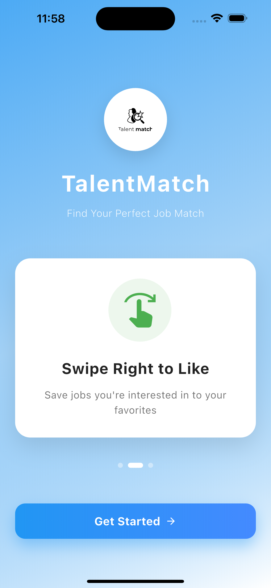
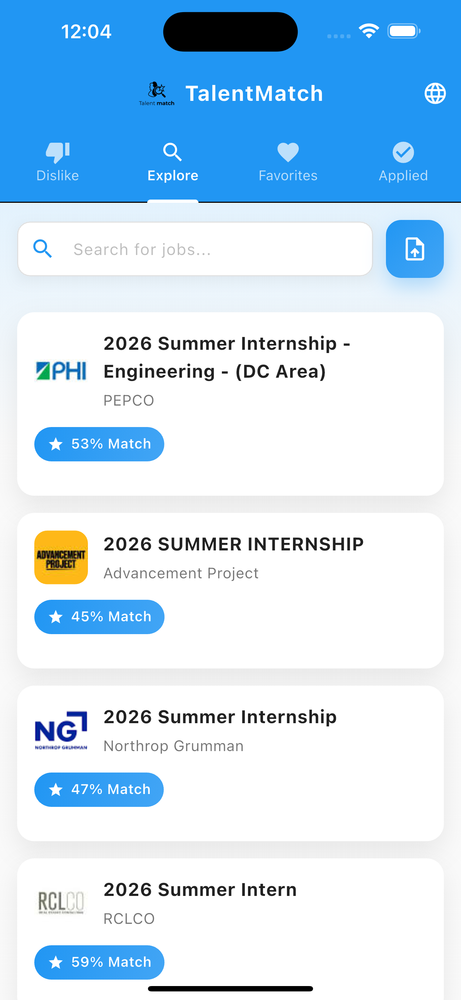
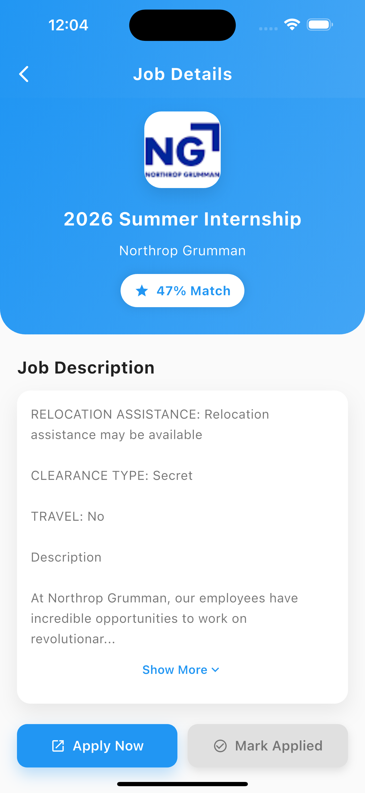

# TalentMatch

group members - Devansh Waleacha and Aaron Huynh

**Find Your Perfect Job Match with AI-Powered Relevance Scoring**

TalentMatch is a modern Flutter mobile application that revolutionizes job searching by using intelligent resume matching to rank job opportunities. Swipe through job listings Tinder-style, upload your resume for personalized relevance scores, and organize opportunities into favorites, applied, and rejected categories.

---

**The Problem:**  
Job seekers waste countless hours scrolling through irrelevant job postings that don't match their skills and experience. Traditional job boards show hundreds of listings with no personalization.

**Our Solution:**  
TalentMatch uses **resume analysis** to calculate how well each job matches your background. Upload your resume once, and every job listing gets a **relevance score (0-100%)** based on term frequency and cosine similarity algorithms. 

**Key Features:**
- **Resume Upload** - Support for PDF and DOCX formats
- **Smart Matching** - Cosine similarity algorithm ranks jobs by relevance
- **Swipe Interface** - Tinder-style swipe right to like, left to pass
- **Job Organization** - Four organized tabs: Explore, Favorites, Applied, Disliked
- **Multi-language** - Support for English, Spanish, and French
- **Beautiful UI** - Modern gradient design with smooth animations
- **Direct Apply** - One-tap application to job postings

---

## APIs & Services Used

### **JSearch API (RapidAPI)**
- **Purpose:** Real-time job search across multiple job boards
- **Endpoint:** `https://jsearch.p.rapidapi.com/search`
- **Features Used:**
  - Job title, employer name, and descriptions
  - Company logos
  - Direct application links
  - Location-based filtering (US)
- **Authentication:** RapidAPI Key (Header-based)
- **Rate Limiting:** Managed through RapidAPI dashboard

### **Local Services**
- **File Picker** - Resume file selection (PDF/DOCX)
- **PDF Text Extraction** - Parse text from PDF resumes
- **DOCX Parser** - Extract text from Word documents
- **URL Launcher** - Open job application links in browser

---

<p align="center">
  
  
  
</p>


---

## MVVM architecture

The MVVM (Model–View–ViewModel) architecture in TalentMatch cleanly separates the UI from application logic, making the app easier to scale and maintain. Views are responsible only for displaying the interface and capturing user interactions such as swipes, taps, or searches. They never contain business logic; instead, they forward all actions to ViewModels, which manage state, run the core logic (like fetching jobs, parsing resumes, and computing relevance scores), and notify the UI when updates occur through the Provider ChangeNotifier pattern. The Models and Services layer handles data storage, API communication, resume parsing, and similarity computations. With this structure, each layer has a single responsibility: Views render, ViewModels decide, and Models provide data creating a clean, reactive workflow where UI updates automatically whenever the underlying data changes.


```
┌─────────────────────────────────────────────────────────────────┐
│                            VIEWS (UI)                            │
├─────────────────────────────────────────────────────────────────┤
│  • LandingScreen          - Onboarding with animations          │
│  • HomeTabsScreen         - Main navigation (4 tabs)            │
│  • JobSearchScreen        - Search & swipe interface            │
│  • AcceptedJobsScreen     - Favorited jobs list                 │
│  • RejectedJobsScreen     - Disliked jobs list                  │
│  • AppliedJobsScreen      - Jobs marked as applied              │
│  • JobDetailsScreen       - Full job description & actions      │
│                                                                  │
│  Widgets:                                                        │
│  • JobCard                - Reusable job card component         │
│  • JobList                - Scrollable list of job cards        │
└─────────────────────────────────────────────────────────────────┘
                                   │
                                   │ User Interactions
                                   │ (Tap, Swipe, Search)
                                   ▼
┌─────────────────────────────────────────────────────────────────┐
│                        VIEWMODELS (Logic)                        │
├─────────────────────────────────────────────────────────────────┤
│  JobViewModel (ChangeNotifier)                                  │
│  ├── State Management:                                          │
│  │   • jobs: List<Job>              - Search results           │
│  │   • acceptedJobs: List<Job>      - Favorited jobs           │
│  │   • rejectedJobs: List<Job>      - Disliked jobs            │
│  │   • appliedJobs: List<Job>       - Applied jobs             │
│  │   • isLoading: bool              - Loading state            │
│  │   • resumeText: String?          - Uploaded resume          │
│  │                                                              │
│  ├── Business Logic:                                            │
│  │   • searchJobs(query)            - Fetch & rank jobs        │
│  │   • uploadResume(text)           - Store resume text        │
│  │   • acceptJob(job)               - Add to favorites         │
│  │   • rejectJob(job)               - Add to rejected          │
│  │   • markApplied(job)             - Track applications       │
│  │   • toggleApplied(job)           - Toggle applied status    │
│  │                                                              │
│  └── Notifies Views on State Changes                           │
│                                                                  │
│  LocaleProvider (ChangeNotifier)                                │
│  └── Manages app language (EN/ES/FR)                           │
└─────────────────────────────────────────────────────────────────┘
                                   │
                                   │ API Calls & Data Processing
                                   ▼
┌─────────────────────────────────────────────────────────────────┐
│                      MODELS & SERVICES                           │
├─────────────────────────────────────────────────────────────────┤
│  MODELS:                                                         │
│  • Job                    - Job data structure                  │
│    ├── id: String                                               │
│    ├── title: String                                            │
│    ├── employer: String                                         │
│    ├── description: String                                      │
│    ├── logo: String?                                            │
│    ├── applyLink: String?                                       │
│    ├── relevance: int     (0-100% match score)                 │
│    └── hasApplied: bool                                         │
│                                                                  │
│  SERVICES:                                                       │
│  • JobApiService          - HTTP calls to JSearch API           │
│    └── searchJobs(query) -> List<Job>                          │
│                                                                  │
│  • ResumeParser           - Extract text from files             │
│    └── parseResumeFile() -> String?                            │
│                                                                  │
│  • SimilarityService      - matching algorithm               │
│    ├── termFrequency(text) -> Map<String, double>              │
│    ├── cosineSimilarity(a, b) -> double                        │
│    └── relevanceScore(resume, jobDesc) -> int                  │
│                                                                  │
│  • AppTheme               - Centralized theme configuration     │
└─────────────────────────────────────────────────────────────────┘
```

### **Data Flow:**

1. **User Action** → View captures interaction (search, swipe, tap)
2. **View** → Calls ViewModel method
3. **ViewModel** → Requests data from Services/API
4. **Services** → Process data (API call, resume parsing, similarity calculation)
5. **ViewModel** → Updates state and calls `notifyListeners()`
6. **View** → Automatically rebuilds with new data (Provider pattern)

---

## 🛠️ Build Instructions

### **Prerequisites**

- Flutter SDK 3.0+ 
- Dart SDK 3.0+
- Android Studio / Xcode (for emulators)
- RapidAPI Account with JSearch API key

### **Step 1: Clone the Repository**

```bash
git clone https://github.com/yourusername/talentmatch.git
cd talentmatch
```

### **Step 2: Install Dependencies**

```bash
flutter pub get
```

### **Step 3: Configure API Key**

1. Sign up at [RapidAPI](https://rapidapi.com/)
2. Subscribe to [JSearch API](https://rapidapi.com/letscrape-6bRBa3QguO5/api/jsearch)
3. Open `lib/config/api_config.dart`
4. Replace the API key:

```dart
class ApiConfig {
  static const String rapidApiKey = "YOUR_RAPIDAPI_KEY_HERE";
}
```


### **Step 4: Run the App**

```bash
# List available devices
flutter devices

# Run on connected device/emulator
flutter run

```

---
